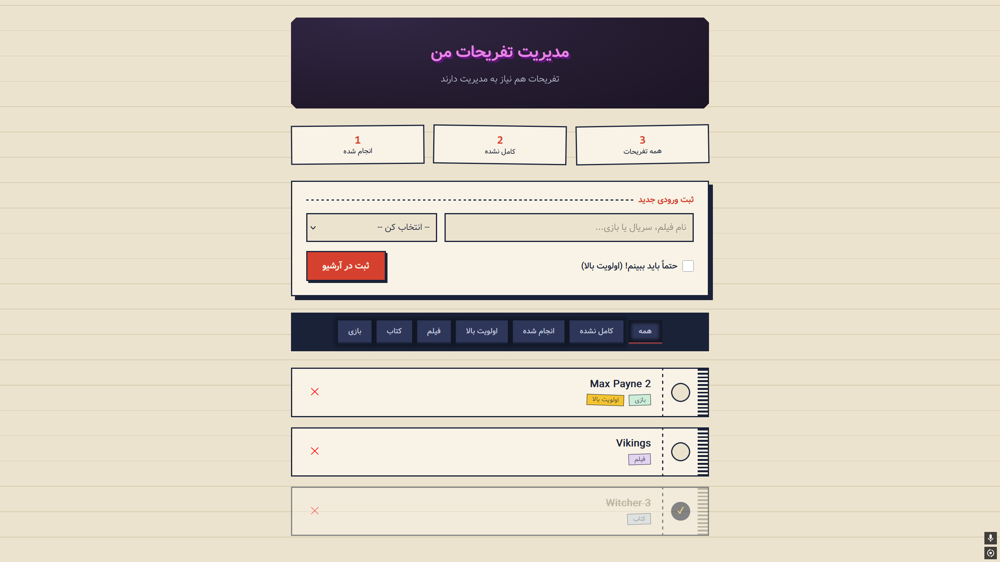

# 🎬 مدیریت تفریحات من

> یک لیست شیک و کاملاً تعاملی برای مدیریت فیلم‌ها، سریال‌ها و بازی‌هایی که می‌خوای تجربه کنی — ساخته‌شده با **HTML, CSS (Flexbox)، و JavaScript خالص**، بدون هیچ فریم‌ورک یا کتابخونه‌ای.

<div align="center">


</div>

---

## 📸 پیش‌نمایش

<div align="center">
  
</div>

---

## ✨ ویژگی‌ها

- 🗂️ **افزودن آیتم جدید** — فیلم، سریال یا بازی، با امکان علامت‌گذاری «اولویت بالا»
- ✅ **علامت‌گذاری به‌عنوان دیده‌شده** با یک کلیک
- 🗑️ **حذف آیتم‌ها** از لیست
- 🔍 **فیلتر کردن** بر اساس وضعیت (روی قفسه / برگردونده‌شده) یا نوع محتوا (فیلم / سریال / بازی) یا اولویت
- 📊 **آمار زنده** (کل موارد، باقی‌مانده، دیده‌شده) که با هر تغییر آپدیت می‌شه
- 📱 **کاملاً ریسپانسیو** — تجربه‌ی یکسان روی موبایل، تبلت و دسکتاپ
- 🎨 **طراحی اختصاصی** با هویت بصری منحصربه‌فرد (نه یک قالب عمومی)
- ⚡ **بدون وابستگی** — فقط HTML, CSS و Vanilla JS؛ هیچ نصب یا build لازم نیست

---

## 🛠️ تکنولوژی‌ها

| تکنولوژی                 | استفاده                                          |
| ------------------------ | ------------------------------------------------ |
| **HTML5**                | ساختار معنایی صفحه                               |
| **CSS3 (Flexbox)**       | چیدمان کامل ریسپانسیو بدون Grid یا فریم‌ورک      |
| **JavaScript (Vanilla)** | تمام منطق برنامه — افزودن، حذف، فیلتر، رندر پویا |
| **Google Fonts**         | Vazirmatn (فارسی) + Space Mono (جزئیات)          |

---

## 🚀 اجرا روی سیستم خودت

هیچ نصب یا dependency‌ای لازم نیست. کافیه:

```bash
git clone https://github.com/USERNAME/REPO_NAME.git
cd REPO_NAME
```

سپس فایل `index.html` رو مستقیم توی مرورگر باز کن، یا با یک سرور لوکال ساده اجرا کن:

```bash
# با Python
python3 -m http.server 8000

# یا با VS Code Live Server
```

و به آدرس `http://localhost:8000` برو.

---

## 📁 ساختار پروژه

```
.
├── index.html        # کل پروژه: HTML + CSS + JS در یک فایل
├── screenshots/
│   └── preview.png    # اسکرین‌شات پیش‌نمایش (برای README)
└── README.md
```

---

## 🎯 درباره‌ی این پروژه

این پروژه به‌عنوان یک **تمرین یادگیری** ساخته شده تا روی مفاهیم زیر کار بشه:

- چیدمان واکنش‌گرا (Responsive Layout) با Flexbox خالص
- دستکاری DOM با جاوااسکریپت خام (بدون React یا هیچ کتابخانه‌ای)
- مدیریت state ساده در سمت کلاینت (افزودن/حذف/فیلتر آرایه‌ی داده)
- طراحی رابط کاربری فارسی (RTL) با فونت و تایپوگرافی مناسب

---

## 📝 لایسنس

این پروژه آزاد است برای استفاده، یادگیری و توسعه‌ی شخصی.

---

<div align="center">
  ساخته‌شده با 💜 برای تمرین و یادگیری
</div>
